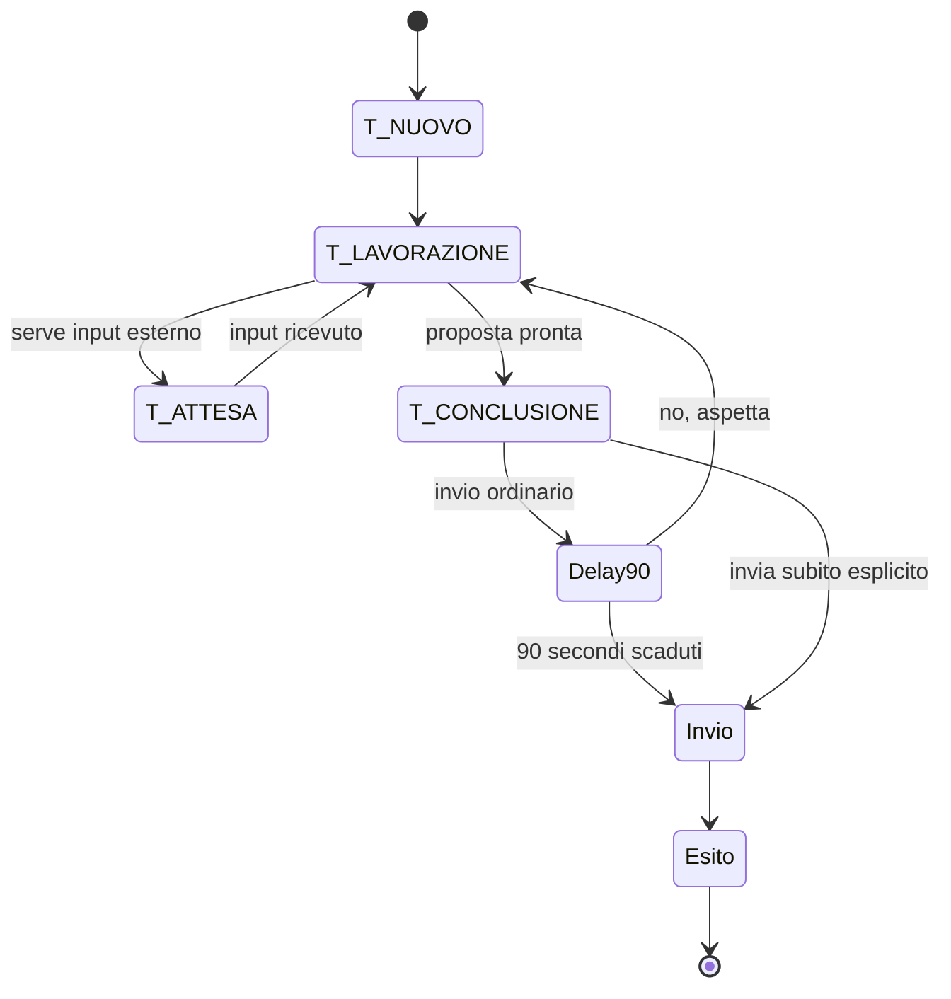

# Proposta — UI consolidata

**Stato:** bozza da approvare

**Data:** 22 settembre 2026

**Ambito:** DESK, Bubble, Sidebar, Timeline, Notificationbar e flusso visivo di invio.
**Non modifica:** il codice. Dopo approvazione, questo documento diventa la base da riversare nelle tavole L0–L4 e nei test di accettazione.

## Decisioni già confermate

Queste decisioni provengono dalla conferma del proprietario del progetto del 22 settembre 2026 e prevalgono sulle scene o descrizioni incompatibili:

1. Ogni invio esterno segue `T_CONCLUSIONE → Delay di 90 s → chiamata al servizio → esito`. Durante il Delay, «no, aspetta» impedisce davvero la chiamata. «Invia subito» è un bypass esplicito, definitivo e valido solo per quell'invio.
2. Il modello dei task usa `T_NUOVO`, `T_LAVORAZIONE`, `T_ATTESA`, `T_CONCLUSIONE`. Un task è in DESK oppure in SIDEBAR, mai in entrambe.
3. I sotto-task sono task autonomi: hanno stato proprio, sono visibili separatamente e possono avanzare in parallelo al task che li ha generati.
4. L'applicazione deve usare React, Vite e Tailwind.
5. Nel prototipo l'unica scrittura persistente autorizzata è la chat raw JSONL. Memoria intelligente, abitudini automatiche ed endpoint di scrittura non documentati restano disabilitati o vengono rimossi.
6. I documenti dell'utente sono la fonte di configurazione; valori hardcoded non documentati devono sparire.
7. Se OpenRouter non è disponibile, l'azione si blocca e l'interfaccia mostra un errore chiaro. Non esiste un fallback finto silenzioso.
8. Una notifica esterna non è un task. Diventa un task solo quando l'utente lo chiede esplicitamente.

## Regole consolidate proposte

### 1. Task, Desk e Sidebar

Un task è rappresentato da una sola Bubble, in una sola area.

| Situazione | Area | Rappresentazione | Regola |
| --- | --- | --- | --- |
| Creato, lavorato o richiede attenzione immediata | DESK | Bubble | La Bubble può essere la `main` se è il referente della conversazione corrente. |
| L'utente lo mette da parte, è sospeso, è in attesa senza richiedere attenzione immediata, oppure è rimandato | SIDEBAR | Chip | Il chip conserva titolo, icona, un solo dato utile e l'ora per i rimandati. |
| Riaperto, nominato o ripreso | DESK | Bubble | Torna in DESK; se la posizione precedente è libera può riutilizzarla. |
| Concluso senza invio esterno | DESK | Bubble | Mostra l'esito per 6 s, poi esce dall'interfaccia. Non diventa archivio di task. |
| Concluso con invio esterno soggetto a Delay | DESK, poi SIDEBAR | Bubble, poi chip | Il chip rappresenta una chiamata **non ancora eseguita** e mostra il tempo residuo. |
| Inviato con esito | DESK o SIDEBAR | esito transitorio | Mostra l'esito per 6 s e poi esce dall'interfaccia. Dopo l'invio non esiste più undo. |

`T_ATTESA` descrive lo stato, non l'area. Un task in attesa può restare in DESK se è la cosa a cui l'utente sta parlando; può diventare chip se è stato messo da parte. La `main` è una sola e indica il task riferito dallo scambio, non una gerarchia di importanza.

Una Bubble inattiva non migra automaticamente dopo 30 minuti. La migrazione in Sidebar è una scelta esplicita dell'utente o una conseguenza delle condizioni definite nella tabella; un timer invisibile non deve cambiare da solo il posto di un lavoro ancora attivo.

### 2. Sequenza visiva dell'invio

La sequenza elimina definitivamente l'undo dopo una chiamata già effettuata.

Per l'invio ordinario, la Bubble in DESK comunica che la proposta è pronta. Dopo una breve transizione visiva può contrarsi in un chip della Sidebar, ma il chip deve dire chiaramente, per esempio, `Invio fra 01:12` e offrire il solo comando conversazionale «no, aspetta». Alla scadenza il sistema esegue la chiamata. Se l'utente annulla, il task torna in `T_LAVORAZIONE` e risale in DESK; non viene dichiarato inviato.

Il bypass «invia subito» chiama il servizio senza Delay. L'interfaccia non offre annullamento dopo l'attivazione del bypass. Errori di rete o di servizio producono un esito esplicito e un task recuperabile; non vengono trasformati in successo né inviati a un interprete finto.

### 3. Bubble e focus

La Bubble è la rappresentazione di un task. Contiene solo il proprio contesto, stato, dati e frasi pertinenti. Non esistono Bubble annidate.

- In DESK può essere presente una sola Bubble `main` alla volta; le altre restano leggibili e non si rimpiccioliscono per farle posto.
- Durante acquisizione e dettatura INPUT cambia soltanto INPUT e, se pertinente, la raccolta. Nessuna Bubble prende fuoco, cresce o migra prima che l'interpretazione abbia identificato il task.
- Al termine dell'interpretazione, il task riconosciuto può diventare `main` con un'unica transizione di focus. Se il riconoscimento è incerto, nessun task riceve focus e l'assistente chiede chiarimento.
- Il focus non cambia stato al task. È una proprietà temporanea della conversazione.
- I dettagli della Bubble non superano 720 px: il contenuto lungo viene reso consultabile all'interno, senza creare una quinta taglia o una vista a schermo intero.

Le animazioni sono reattive a un fatto di dominio: nascita, focus, contrazione, migrazione, uscita. Nessuna animazione decorativa continua. Solo DESK partecipa alle collisioni e agli spostamenti; le aree di cornice restano ferme, salvo la pila verticale descritta sotto.

### 4. Sidebar

La Sidebar contiene solo task vivi: messi da parte, in attesa non immediata, rimandati e invii nel loro Delay. Non contiene task conclusi come archivio.

- I chip sono alti 30 px e mostrano icona, nome e un solo dato; il testo non deve uscire dal chip.
- Se gli elementi visibili superano quattro, mostra i primi quattro e un chip `+N` che apre la vista completa della Sidebar. `+N` non è un task e non altera il conteggio delle notifiche.
- Un rimandato resta in Sidebar con la sua ora; quando l'ora scade torna a richiedere attenzione in DESK, senza diventare una notifica esterna.
- Una notifica promossa genera un nuovo task in `T_NUOVO`; la riga della notifica rimane nella Notificationbar e non migra.

### 5. Notificationbar

La Notificationbar rappresenta il mondo esterno, ordinato temporalmente. Le sue righe conservano mittente, oggetto e ora reali e non hanno stato né luogo di task.

- Il filtro non promuove notifiche automaticamente.
- «Me ne occupo» crea un nuovo task in `T_NUOVO` su DESK; la notifica originale resta consultabile nel cassetto.
- Eventi futuri provenienti dall'esterno restano notifiche; task rimandati dall'utente restano chip in Sidebar. Le due cose non condividono lista né semantica.
- Il badge conta le notifiche pertinenti non ancora viste, non i task in attesa o rimandati.

### 6. Timeline e guida destra

La Timeline è una cornice informativa, non un task e non una Bubble. È un'eccezione esplicita alla legge generale delle Bubble, insieme alla Systembar.

Mostra esclusivamente:

- attività attuale e tempo trascorso, quando esiste;
- prossima attività e tempo rimanente, quando esiste;
- tempo libero disponibile quando non esiste attività attuale.

Non mostra task conclusi, non offre frasi suggerite, non si apre, non diventa chip e non duplica il contenuto di una Bubble. Una domanda sul calendario o sul tempo crea invece un task in DESK.

La guida destra è una **pila a dipendenza limitata**, non una colonna di layout generale:

1. Timeline: `right: 44px`, `top: 40px`, altezza determinata dal contenuto.
2. Profilebar: `right: 44px`, 22 px sotto il bordo inferiore della Timeline; è una Bubble che si stringe al proprio contenuto.
3. Systembar: `right: 44px`, 22 px sotto il bordo inferiore della Profilebar; è inchiostro diretto.
4. Sidebar: `right: 44px`, `top: 180px`, con lista propria; non viene spostata dalla crescita della Timeline.

La dipendenza verticale Timeline → Profilebar → Systembar è intenzionale. Non estende il movimento al DESK, a INPUT, alla Notificationbar o alla Sidebar e quindi non crea una griglia condivisa per l'intera interfaccia.

### 7. Punti da aggiornare nelle tavole dopo approvazione

| Documento | Aggiornamento richiesto |
| --- | --- |
| `L0 - Sistema.md` | Esplicitare Timeline e Systembar come uniche eccezioni alla legge delle Bubble; sostituire la contraddizione sull'autonomia con la pila a dipendenza limitata. |
| `L2 - Bubble.dc.html` | Eliminare focus durante la dettatura e migrazione automatica dopo 30 minuti; sostituire l'undo post-invio con il Delay pre-invio. |
| `L2 - TIMELINE.dc.html` | Allineare Timeline come inchiostro diretto, non task, con dati derivati dal lavoro attuale/prossimo e senza Bubble esemplificativa. |
| `L2 - Sidebar.dc.html` | Rendere vincolanti `top: 180px`, limite di quattro chip e `+N`; distinguere chip Delay, rimandati e task messi da parte. |
| `L3 - Flusso task.dc.html` | Ridisegnare la sequenza conclusione → Delay → chiamata → esito e rimuovere l'undo dopo «Mandata». |
| `L4 - Schermate.dc.html` | Aggiornare le schermate con il nuovo flusso, le quote consolidate e il comportamento di focus post-interpretazione. |

## Criteri di accettazione per l'implementazione

1. Nessuna chiamata a un servizio di invio avviene prima della scadenza del Delay, salvo bypass esplicito sul task corrente.
2. «No, aspetta» durante il Delay impedisce la chiamata e riporta il task in lavorazione; dopo il bypass o l'invio non promette annullamento.
3. In ogni istante un task compare in una sola fra DESK e Sidebar; una notifica non compare in nessuna delle due finché non viene promossa.
4. La Sidebar non espone più di quattro chip senza il chip `+N`.
5. Un input in acquisizione non cambia il focus del DESK; il focus cambia solo dopo un'interpretazione riuscita e non ambigua.
6. Timeline non seleziona task conclusi e non replica Bubble o comandi del task.
7. Tutte le viste sono componenti React e usano i token Tailwind del tema chiaro/scuro condiviso.

## Esito richiesto

L'approvazione di questa proposta autorizza l'aggiornamento delle tavole elencate e la derivazione dei test di accettazione. Non autorizza ancora la migrazione del codice: quella verrà pianificata dopo l'aggiornamento documentale e il backlog della tranche di sicurezza.
